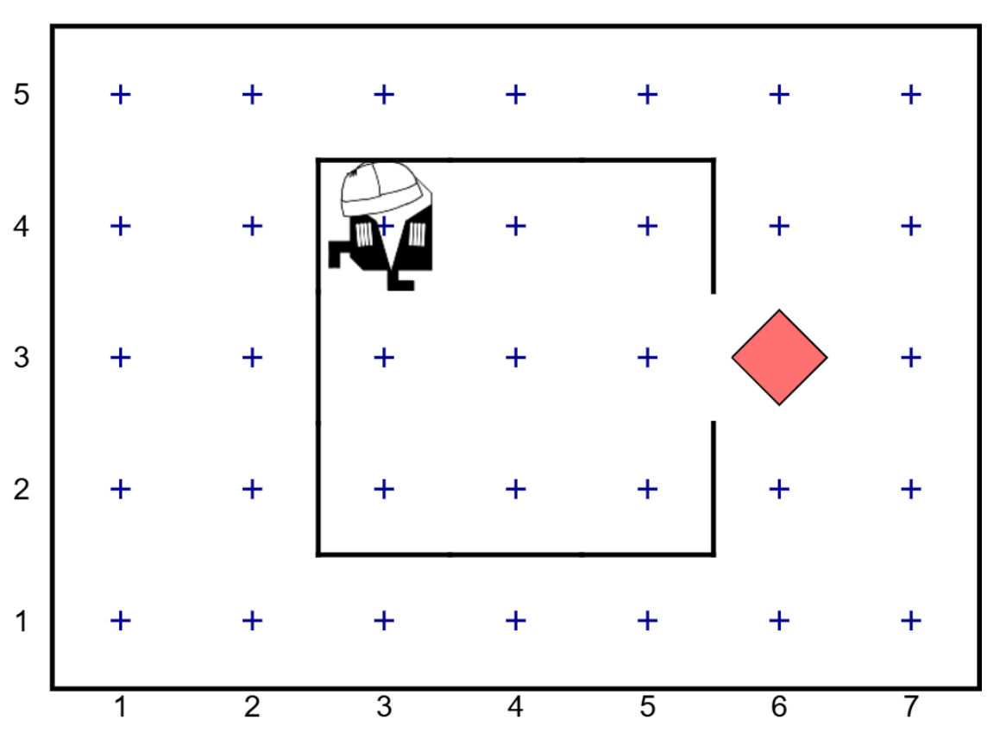
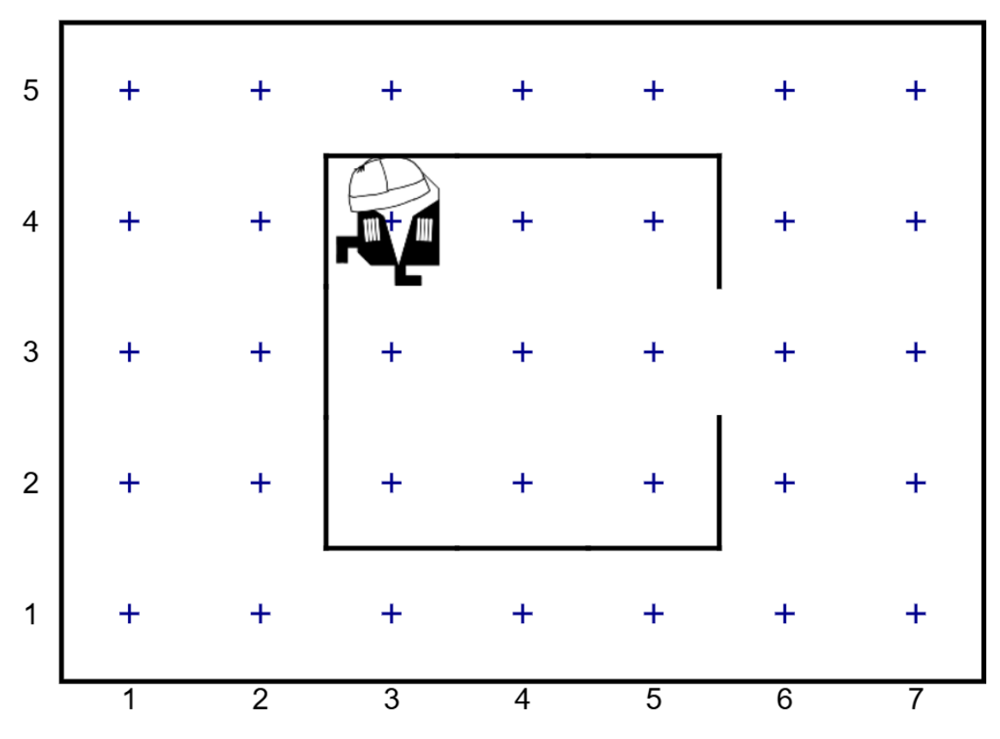

# I. ჩაიბარე ამანათი

ამანათი მოვიდა! დაეხმარე კარლოს მივიდეს კართან, აიღოს იგი და დაბრუნდეს თავდაპირველ ადგილას.

<iframe src="https://rezi-gelenidze.github.io/karlo-ide/?task=foodCollect" width="100%" height="500px"></iframe>

