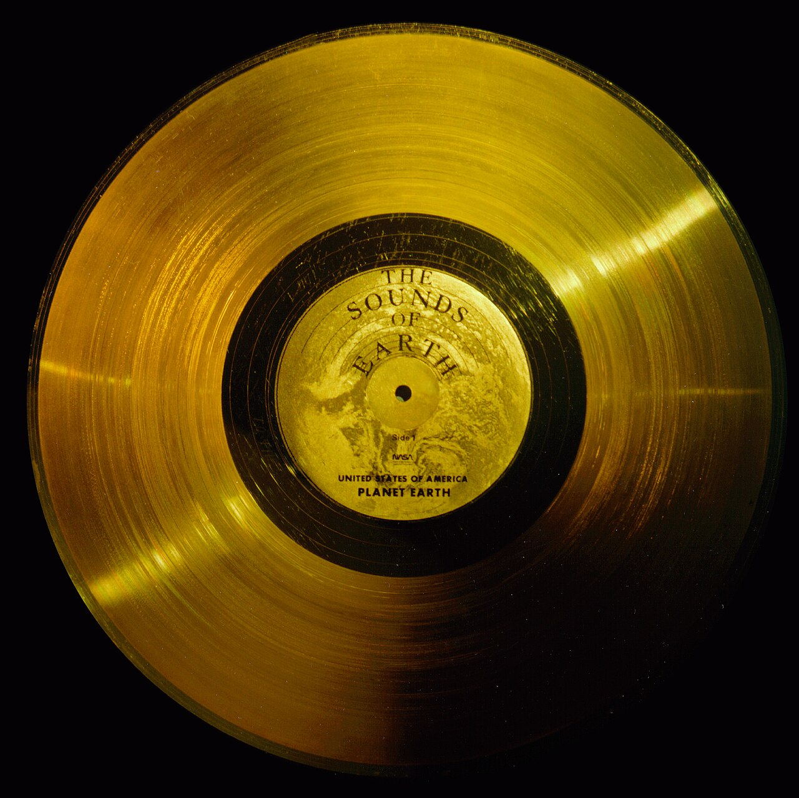
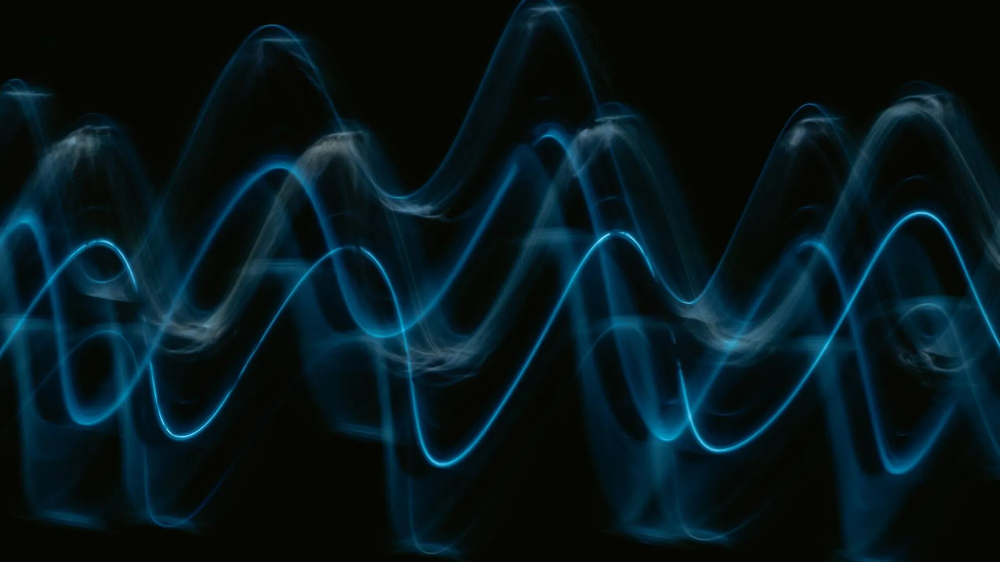
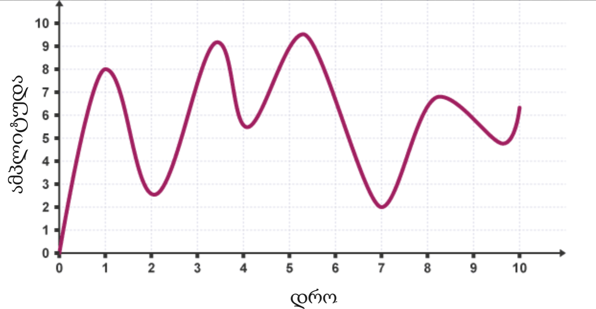
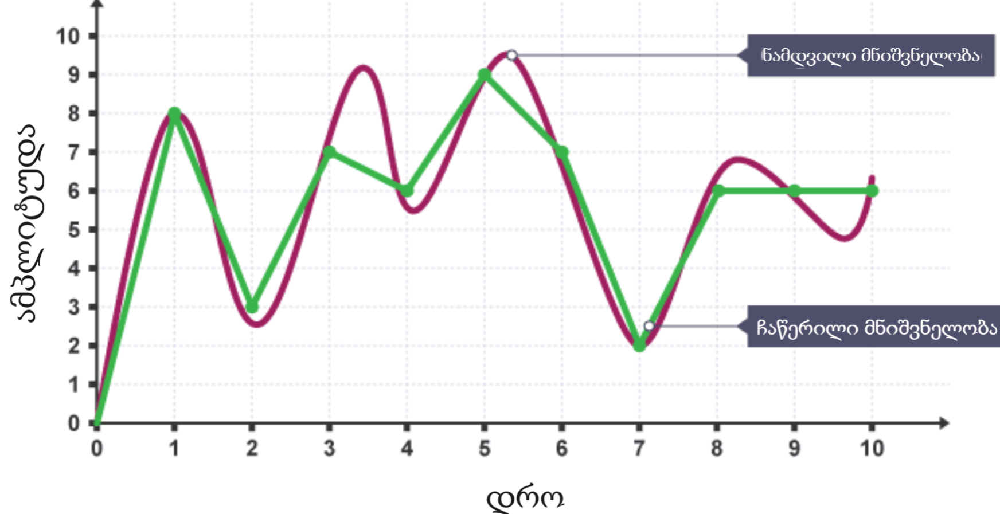
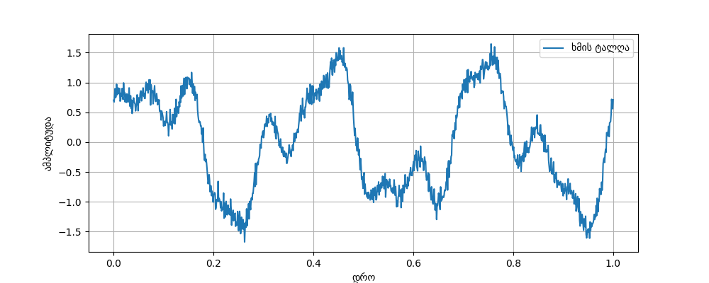
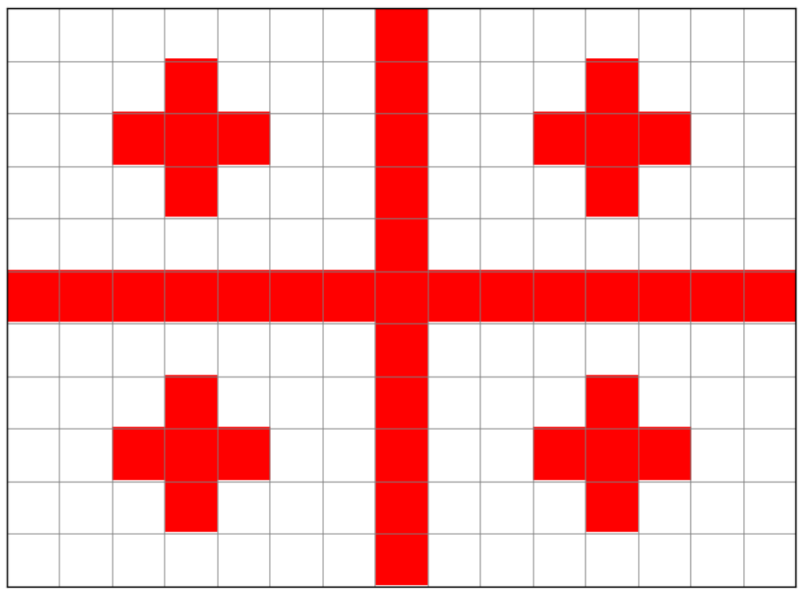

# ქართული ვოიაჟერი

### შესავალი

1977 წელს **NASA** _მ გაგზავნა ორი კოსმოსური ზონდი - ვოიაჟერ 1 და ვოიაჟერ 2. ისინი მუდმივად მოძრაობენ კოსმოსში და 2012 წელს მზის სისტემასაც კი გასცდნენ.

ისინი დღემდე უკავშირებიან სადგურს დედამიწაზე და აწვდიან ინფორმაციას მათი გარემოებების შესახებ.

### ოქროს ფირფიტა

სიმბოლურად, ამ ზონდებში ჩადეს "ოქროს ფირფიტები", რომლებზედაც დატანილია ინფორმაცია კაცობრიობის შესახებ:
- მისალმებები 55 ენაზე.
- მუსიკა სხვადასხვა ერისა და ეპოქისა, რომელთა შორისაც არის ქართული ხალხური სიმღერა "ჩაკრულო"!
- ცხოველების, ბუნებისა და სხვა ხმები
- დედამიწის, ადამიანისა და ფლორა-ფაუნის სურათები
- მაშინდელი თანამდებობის პირების (გაეროს გენერალური მდივანი და აშშ პრეზიდენტი) მიმართვები.
- ადამიანის გენომისა და სხვა სამეცნიერო შინაარსის ინფორმაცია

ზონდები თავისუფლად და უწყვეტად მოძრაობენ კოსმოსში და თუკი გონიერი უცხოპლანეტელი ცივილიზაცია მას წააწყდება, შეეძლება დედამიწის შესახებ ინფორმაციის წაკითხვა. ეს სიმბოლურად გავს წერილიანი ბოთლის ოკეანეში გადაგდებას. მასზე დატანილი ინფორმაცია განსაკუთრებული სისტემებითაა გადმოცემული, რათა ნებისმიერმა მოაზროვნე არსებამ პოტენციურად შეძლოს მისი წაკითხვა.

### ქართული ვოიაჟერი!

**NASA**_სა და **QBit**_ს თანამშრომლობით დღეს ჩვენ ვუშვებთ ჩვენს კოსმოსურ ზონდსაც, რომელსაც ასევე გავატანთ ქართულ ოქროს ფირფიტას.

პირობითად ჩავთვალოთ, რომ უცხო ცივილიზაციას **შეეძლება ბინარული სისტემის გააზრება**. ჩვენ გვინდა ფირფიტაზე ჩავწეროთ:

- სიმღერა "ჩაკრულო"
- სიტყვები: "გამარჯობა!", "ხაჭაპური", "🇬🇪"
- საქართველოს დროშის სურათი

დაეხმარე კოსმონავტებს, გადათარგმნონ ინფორმაცია ბინარულ სისტემაში!
### დავალება

ჩვენ გვაქვს 3 ტიპის ინფორმაცია, რომელიც უნდა გადავთარგმნოთ:

- ჩაკრულოს ფრაგმენტი
- 3 სიტყვა: "გამარჯობა!", "ხაჭაპური", "🇬🇪"
- საქართველოს დროშის სურათი

#### 1. ჩაკრულოს ფრაგმენტი

##### მოიცა, აუდიო როგორ გამოვსახო?

ლექციაზე ჩვენ განვიხილეთ, თუ როგორ გამოგვესახა ტექსტი, ფოტო და ვიდეო, თუმცა, აუდიოს ორობით სისტემაში გამოსახვა არ გვიხსენებია.

აუდიო რეალურად არის ხმის ტალღები, რომლებიც სივრცეში მოძრაობენ და ამ ტალღებით ჩვენი ყურის ბარაბანზე გამოწვეული ვიბრაციით შევიგრძნობთ ხმას. დინამიკი რეალურად ქმნის ამ ხმის ტალღებს, ხოლო მიკროფონი, როგორც ადამიანის ყური, აფიქსირებს მათ.

აუდიოს გამოსახვა კი დაიყვანება ხმის **ტალღის გამოსახვის** პრობლემამდე.

მოდი ტალღა გამოვსახოთ როგორც ფუნქციის გრაფიკი. კონკრეტულ დროის წერტილში, მას აქვს რაღაც მნიშვნელობა (ამპლიტუდა), ანუ ხმა ან მაღალია ან დაბალი იმ მომენტში.

თუ ჩვენ ამ მნიშვნელობებს ამოვწერთ კონკრეტულ დროის მომენტებში, ჩვენ შევინახავთ ტალღის დაახლოებით ფორმას ($x$ მომენტში დამრგვალებულ $f(x)$ მნიშვნელობას):

| ნიმუშის N | 1    | 2    | 3    | 4    | 5    | 6    | 7    | 8    | 9    | 10   |
| --------- | ---- | ---- | ---- | ---- | ---- | ---- | ---- | ---- | ---- | ---- |
| ათობითი   | 8    | 3    | 7    | 6    | 9    | 7    | 2    | 6    | 6    | 6    |
| ორობითი   | 1000 | 0011 | 0111 | 0110 | 1001 | 0111 | 0010 | 0100 | 0110 | 0110 |

ჩვენ ტალღის დაახლოებითი ფორმა წარმოვადგინეთ რიცხვებად, ანუ გავაციფრულეთ! ჩაწერილი ფორმა (მწვანე) არც ისე ახლოსაა რეალურთან, თუმცა რაც უფრო მოკლე ინტერვალებში ავიღებთ ნიმუშებს, მაშინ ჩვენი ამოწერილი ტალღის ფორმა უფრო მიუახლოვდება რეალურს. მაგალითად, საშუალო ხარისხის აუდიო (CD-quality) შეიცავს 44100 (44.1KH) ნიმუშს ყოველ 1 წამში მოხაზული ტალღის ფორმიდან. ამ ჩაწერილი ტალღის ინფორმაციას უკვე ჩვენი კომპიუტერი ამუშავებს და მას შეუძლია დინამიკით იგივე ამპლიტუდის ტალღები დააგენერიროს! ჩვენი საყვარელი მუსიკების ფაილები (.mp3, .wav, ა.შ) რეალურად ხმის ტალღების ამოწერილი ვერსიებია.

თანამედროვე აუდიო შედგება მილიონობით ამოწერილი ნიმუშებისგან (44000+ ამოწერილი ტალღის წერტილი წამში), ამიტომ მთლიანი ჩაკრულოს ხელით ამოწერა რთული იქნება (მით უმეტეს 7 ხმაში...)

ამჯერად ჩვენ გადავთარგმნოთ ბინარულ სისტემაში აუდიოს პატარა ფრაგმენტი. დანარჩენის გასაკეთებლად მომავალში კომპიუტერი დავაპროგრამოთ რომ ეს საქმე ჩვენთვის გააკეთოს.

ეს არის პირობითი ნაწყვეტი ჩაკრულოს ერთი წამიდან (0:00 - 0:01), სადაც ტალღის ამპლიტუდა მოძრაობს \[-128:127] დიაპაზონში.

##### 1.1 ამოიწერე ნიმუშები ათობით სისტემაში

აიღე ტალღის ნიმუშები, ანუ ამოიწერე დაახლოებით რა არის ტალღის ამპლიტუდა $x \in [0, 1]$  $f(x) \in [-128:127]$ შუალედში, 0,2 წამის ინტერვალით.

| დრო (წმ) | ამპლიტუდა |
| -------- | --------- |
| 0.0      |           |
| 0.2      |           |
| 0.4      |           |
| 0.6      |           |
| 0.8      |           |
| 1.0      |           |
##### 1.2 ორობითში გადაყვანა

ახლა ამპლიტუდის მნიშვნელობები გადავიყვანოთ ორობით სისტემაში, მაგრამ, როგორ გადავიყვანოთ უარყოფითი რიცხვები ორობითში?
###### უარყოფითი რიცხვების გამოსახვა

ჩვენ ვისწავლეთ თვლა დადებითი მთელი რიცხვებისთვის (ნატურალური რიცხვები):

$$0, 1, 10, 11, 100, 101, 110, 111, 1000...$$ 

მაგრამ როგორ გამოვსახოთ უარყოფითი რიცხვები?

მარტივი ვარიანტი იქნებოდა, გამოგვეყო პირველი ბიტი როგორც ნიშანი:
0 იყოს დადებითი, 1 იყოს უარყოფითი. ანუ მარცხენა პირველი ბიტი იქნება არა თანრიგის, არამედ ნიშნის გამომსახველი.

მაგალითად:

$$
\begin{aligned}
\textcolor{green}{0}001_2 = +1_{10} \\ 
\textcolor{green}{1}001_2 = -1_{10} \\
\textcolor{green}{0}110_2 = +6_{10} \\
\textcolor{green}{1}110_2 = -6_{10}
\end{aligned}
$$

მაგრამ, აქ არის ერთი პრობლემა:

$$
\begin{aligned}
\textcolor{green}{0}000_2 = +0_{10} \\ 
\textcolor{green}{1}000_2 = -0_{10}
\end{aligned}
$$
 
ჩვენ გვრჩება 2 ნიშნიანი ნული! ასევე ქვეშმიწერით არითმეტიკას და სხვა მოქმედებებს ასეთი სისტემა მოუხერხებელს ქმნის.

##### 2's Complement Representation

რეალურად კომპიუტერები იყენებენ "ორის კომპლემენტს", რომელიც მოსახერხებელს ხდის ანგარიშს და არ გვაქვს $\pm0$.

არ მკითხოთ, როგორ მოაფიქრდათ, თუმცა ძალიან მოსახერხებელია!

- თუ გვინდა დადებითი რიცხვის ჩაწერა, მაშინ ვწერთ როგორც აქამდე.

$$
5_{10} = 0101_2
$$
მაგრამ -5 იქნება დადებითი ვერსია რომ ამოვატრიალოთ (1 ხდება 0 და 0 ხდება 1) და დავუმატოთ ერთი

$$
0101_2 \xrightarrow{ამოვატრიალოთ} 1010_2 \xrightarrow{+1} 1010_2 + 1_2 = 1011_{2comp}
$$

ანუ

$$
\begin{array} \\
5_{10} = 0101_2 = 0101_{2comp} \\
-5_{10} = 1011_{2comp}
\end{array}
$$

ამ სისტემაშიც უარყოფითები ერთით იწყება, ხოლო დადებითები ნულით, თუმცა არითმეტიკა მარტივი ხდება: ზუსტად ისე ხდება ანგარიში, როგორც უნიშნო სისტემაში, რომელიც აქამდე ვიცოდით (unsigned integers).

| ათობითი | 8 ბიტიანი ორის კომპლემენტი |
| ------- | -------------------------- |
| 5       | `00000101`                 |
| 0       | `00000000`                 |
| -1      | `11111111`                 |
| -5      | `11111011`                 |
| -128    | `10000000`                 |
| 127     | `01111111`                 |

რიცხვების ჩაწერას, სადაც რიცხვის ნიშანსაც ვითვალისწინებთ (გამოვსახავთ), ქვია **Signed Integers (int)**, ხოლო უნიშნო გამოსახვას **Unsigned Integers (uint)**. უფრო ღრმად ამ თემას დავუბრუნდებით შემდეგ ლექციაზე.

---

ახლა კი ამოწერე შენს მიერ შევსებული ცხრილიდან ამპლიტუდის მნიშვნელობები ბინარულ სისტემაში ორის კომპლიმენტით. რამდენი ბიტი დაგჭირდება თითოეული რიცხვისთვის? რატომ არის მაინც და მაინც $[-128:127]$ დიაპაზონი? რამდენი რიცხვია ამ შუალედში?

#### 2. ტექსტი

ტექსტის კოდირება ვისწავლეთ ASCII საშუალებით, სადაც გვქონდა ცხრილი, რომლის საშუალებით ასოებს გამოვსახავდით ცხრილში მისივე ნომრით. ჩვენ ახლა გვინდა გამოვსახოთ 2 სიტყვა და 1 ემოჯი:

- "გამარჯობა!"
- "ხაჭაპური"
- "🇬🇪"

თუმცა ASCII_ში არ არის არც ქართული ასოები, არც ემოჯები. როგორც ლექციაში ვახსენეთ, არსებობს საერთაშორისო ცხრილი **UNICODE**, სადაც გამოსახულია მსოფლიოს ენები, სიმბოლოები და ემოჯები!

მოდით გამოვიყენოთ UNICODE სიტყვების ჩასაწერად!

##### UNICODE მუშაობის პრინციპი

იხილეთ [UNICODE ცხრილი](https://symbl.cc/en/unicode-table/#georgian).

თუმცა აღნიშვნა საკმაოდ უცნაურია. მაგალთად "ა" ცხრილში არის **U+10D0**, რას ნიშნავს ეს?

U+ ნიშნავს რომ ეს კოდი ეკუთვნის UNICODE ცხრილს, მას სხვა მნიშვნელობა არ აქვს.
10D0 არის თექვსმეტობითი სისტემით ჩაწერილი რიცხვი (Hexadecimal). რატომ?

როგორც ASCII ცხრილში, აქაც ჩამონომრილია სიმბოლოები, "ა" ასოს ათობითი ნომერი არის 4304.

მაგალითად, "A" ASCII ში იყო 65, ანუ ორობითში 0100 0001. 

ორობითში რომ ჩავწეროთ 4304, იქნება **0001 0000 1101 0000**. უფრო დიდ ნომრებს კიდევ მეტი ციფრი დასჭირდება. ამიტომ, ადამიანისთვის მარტივად და მოკლედ ბინარული ინფორმაციის ჩასაწერად ვიყენებთ თექვსმეტობით სისტემას, რომელიც საშუალებას გვაძლებს 4 ბიტი გამოვსახოთ 1 ცალი თექვსმეტობით სისტემის ციფრით.

##### თექვსმეტობითი სისტემა (Hexadecimal)

ათობით სისტემაში გვაქვს 10 ციფრი: 

$$0 1 2 3 4 5 6 7 8 9$$

ორობითში კი 2: 

$$01$$

თექვსმეტობით სისტემის პრინციპი იგივეა, თანრიგები არის 16_ის ხარისხები. რაც შეეხება ციფრებს, გვაქვს 16 ცალი:

$$0 1 2 3 4 5 6 7 8 9 ..$$

მაგრამ საიდან მოვიტანოთ კიდევ 6?

ვისესხოთ ინგლისური ასოები a b c d e f და ჩვენი 16 გასნხვავებული ციფრი (სიმბოლო) იქნება:

$$
0 1 2 3 4 5 6 7 8 9 a b c d e f
$$

როგორ გადავიყვანოთ რიცხვი თექვსმეტობითში?

$$
\begin{array} \\
300_{10} = 1 * 256 + 2 * 16 + 12 * 1 \\
1 * 16^2 + 2*16^1 + c*16^0 \\
300_{10} = 12C_{16}
\end{array}
$$

C ამ შემთხვევაში წარმოადგენს 12_ს ერთი სიმბოლოთი.

რაში გვჭირდება? რაც მეტია ფუძე, მით ნაკლები "ციფრი" გვჭირდება. ასევე მოსახერხებელია ორობით სისტემის გამოსახვა თექვსმეტობითში. მისი აღქმა კომპიუტერს არ შეუძლია, იგი მაინც ბინარულში ინახავს და ამუშავებს ინფორმაციას, უბრალოდ იგი ადამიანისთვის ხდება მოსახერხებელი.

მაგალითად:

1010 1001 1100 1111 ბინარულიდან რომ გადავიყვანოთ თექვსმეტობითში, ავიღოთ ყოველი 4 ბიტი და ავღნიშნოთ მისი რიცხობრივი მნიშვნელობა თექვსმეტობითის ციფრით

1010 = 10 ათობითში = A თექვსმეტობითში
1001 = 9 ათობითში = 9 თექვსმეტობითში
1100 = 12 ათობითში = C თექვსმეტობითში
1111 = 15 ათობითში = F თექვსმეტობითში

ანუ 1010 1001 1100 1111 ორობითში, მოკლედ ჩაიწერება, როგორც: A9CF.

ეს ხრიკი მუშაობს იმის ხარჯზე რომ თექვსმეტობითის დიაპაზონი არის 0-15, ისევე როგორც 4 ბიტის:

$0_{10} = 0000_{2} = 0_{16}$
$15_{10} = 1111_2 = F_{16}$

ანალოგიური პრინციპით ხდება თექვსმეტობითიდან ორობითში გადაყვანაც.

მაგალითად "ა" კოდი არის U+10D0 ანუ ნომერი 10D0

$$
\begin{array} \\
1_{16} = 0001_2 \\
0_{16} = 0000_2 \\
D_{16} = 1101_2 \\
0_{16} = 0000_2 \\
\end{array}
$$

$10D0_{16} = 0001 \; 0000 \; 1101 \; 0000_2$ ორობითში. ეს სისტემა ძალიან მოსახერხებელია ბინარული ინფორმაციის მოკლედ წარმოსადგენად ადამიანისთვის, რასაც გზა და გზა შევამჩნევთ.
##### 2.1 ამოწერე სიტყვები UNICODE სისტემის დახმარებით

გადათარგმნე სიტყვები UNICODE_ის U+XXXX ფორმატში:

- "გამარჯობა!"
- "ხაჭაპური"
- "🇬🇪" (საქართველოს დროშის ემოჯი)

გამოიყენე [UNICODE ცხრილი](https://symbl.cc/en/unicode-table/#georgian).

---
###### ბონუს ცოდნა

*კლასიკური ASCII იყენებს 7 ბიტს, ხოლო მისი გავრცელებული ვერსია 8 ბიტს (Extended ASCII). UNICODE მეტი ბიტების გამოყენების ხარჯზე, შეუძლია შეინახოს ბევრად მეტი სიმბოლოები. იგი იყენებს ცვლადი რაოდენობის ბიტებს: 1, 2, 3 ან 4 ბაიტს!. UNICODE ყველაზე გავრცელებული ვერსია არის UTF-8, რომელიც ბაიტებს შემდეგნაირად ანაწილებს (ჩვენი ტექსტიც ამ სტატიაში იყენებს UTF-8 Encoding სისტემას!):

| სიმბოლოს დიაპაზონი       | ბაიტები | მაგალითები                                       |
| ------------------------ | ------- | ------------------------------------------------ |
| U+0000 დან U+007F-მდე    | 1 ბაიტი | ASCII (მაგ: A, a, 1, @)                          |
| U+0080 დან U+07FF-მდე    | 2 ბაიტი | ლათინური, ბერძნული სიმბოლოები                    |
| U+0800 დან U+FFFF-მდე    | 3 ბაიტი | სხვადასხვა ენები (მაგ: ქართული, არაბული, ჩინური) |
| U+10000 დან U+10FFFF-მდე | 4 ბაიტი | ემოჯი, იშვიათი ისტორიული ანბანები                |

 *მეტი ინფორმაციის გასაგებად შეგიძლია გამოიყენო ChatGPT ან Google ; ) 
#### 3.  დროშის სურათი

ჩვენი დროშის სურათი არის 15x11 ზომისაა, სადაც თითოეულ პიქსელს (უჯრას) აქვს შესაბამისი ფერი.

---
##### 3.1 დაწერე პირველი მწკრივის RGB მონაცემები.

**ამოწერე მესამე მწკრივი როგორც RGB მონაცემები. თითოეული ფერი შედგება 3 ნაზავიგან (წითელი, მწვანე, ლურჯი).** 

მაგალითად ლურჯი პიქსელი ჩაიწერება შემდეგნაირად:

$$
0, 0, 255 \rightarrow 00000000 \: 00000000 \: 11111111.
$$
##### 3.2 ინფორმაციის კომპრესირება

თუ ამ სახით ამოვწერთ ინფორმაციას (1 პიქსელი = 24 ბიტი), მაშინ დაგვჭირდება ზედმეტად პიქსელის ინფორმაციის გამეორება და ფოტოს ინფორმაცია ზომაში ტყუილად გაიზრდება. მაგალითად, თუ მეექვსე მწკრივს ამოვწერთ, მოგვიწევს წითელი პიქსელი $(255, 0, 0)$ გავიმეოროთ 15 ჯერ.

თანამედროვე ფოტოს ფორმატები (.png, .jpeg, .HEIF...) იყენებენ ჭკვიანურ სისტემებს, რომ რაც შეიძლება ნაკლები ბიტების გამოყენებით შეინახონ ფოტოები (image compression). მაგალითად, ზოგიერთი ფორმატის მუშაობის პრინციპი არის, აღმოაჩინოს გამეორებული ფრაგმენტი და ინფორმაციის გამეორების ნაცვლად, უბრალოდ დაწეროს რომ ეს ფრაგმენტი N_ჯერ მეორდება.

მაგალითად ჩვენი მეექვსე სვეტი ნაცვლად სათითაოდ 15 ჯერ გაწერისა (15 $\times$ 24 = 360 ბიტი), შეგვიძლია დავწეროთ ასეთ ფორმატში:

[ფერის RGB მნიშვნელობა] [გამეორების რაოდენობა]  

[255 0 0] [15]  

[11111111 00000000 00000000] [0000 1111]  

დაგვჭირდა 24 ბიტი პიქსელისთვის + 8 ბიტი რაოდენობის აღსანიშნად = 32 ბიტი.

შედეგი? 360 $\rightarrow$ 32 ბიტამდე დაყვანით გამოვიყენეთ $11 \frac{1}{4}$_ჯერ ნაკლები ბიტები!

ამ ალგორითმს ეწოდება RLE - Run-Length Encoding. რამდენიმე ფორმატი მას იყენებს, თუმცა არსებობს ბევრად კომპლექსური სისტემები, რომლებიც უფრო ეფექტურად ინახავენ ფოტოებს. 

*მაგალითად, შეგიძლიათ მოიძიოთ ინფორმაცია JPEG ფორმატზე რომელიც აფიქსირებს და აიგნორებს ინფორმაციას (ფერებს), რომლის აღქმა ადამიანის თვალს ისედაც არ შეუძლია!*
  
**ახლა ამოწერე მესამე მწკრივი RLE კოდირების სისტემით.**

##### 3.3 კიდევ უფრო კომპრესირება!

RLE ასევე იყენებს ინდექსირების მეთოდს - დააკვირდება, თუ რა ფერები არის გამოყენებული ფოტოზე და დანომრავს მათ:

მაგალითად ამ ფოტოში არის გამოყენებული წითელი და თეთრი. ვთქვათ წითელი იყოს ფერი 0 და თეთრი ფერი 1.

ინდექსი:

0: 255, 0, 0
1: 255, 255, 255

ახლა კი ფერის მთლიანად გაწერის ნაცვლად გავწეროთ უბრალოდ მისი ნომრით ინდექსიდან.

\[ნომერი]\[რაოდენობა]

მესამე მწკრივი გახდება შემდეგნაირი:

$$
1:2 \quad 0:3 \quad 1:2 \quad 0:1 \quad 1:2 \quad 0:3 \quad 1:2
$$
$$
00000001 \; 00000010 \quad 00000000 \; 00000011 ...
$$
ასე ინფორმაცია კიდევ უფრო ნაკლებ ადგილს დაიკავებს!

**ახლა კი იგივე პრინციპით გააციფრულე შემდეგი მწკრივი:**

### მზად არის!

ესეც ასე! ჩაკრულო, სიტყვები და დროშა მზად არის. ტყემალსა და ჩურჩხელებს ჩავალაგებთ და ქართული ვოიაჟერი მზად არის გასაფრენად! 

**Roger, ready to go Houston! 🚀**